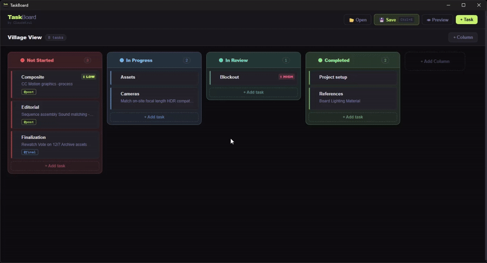
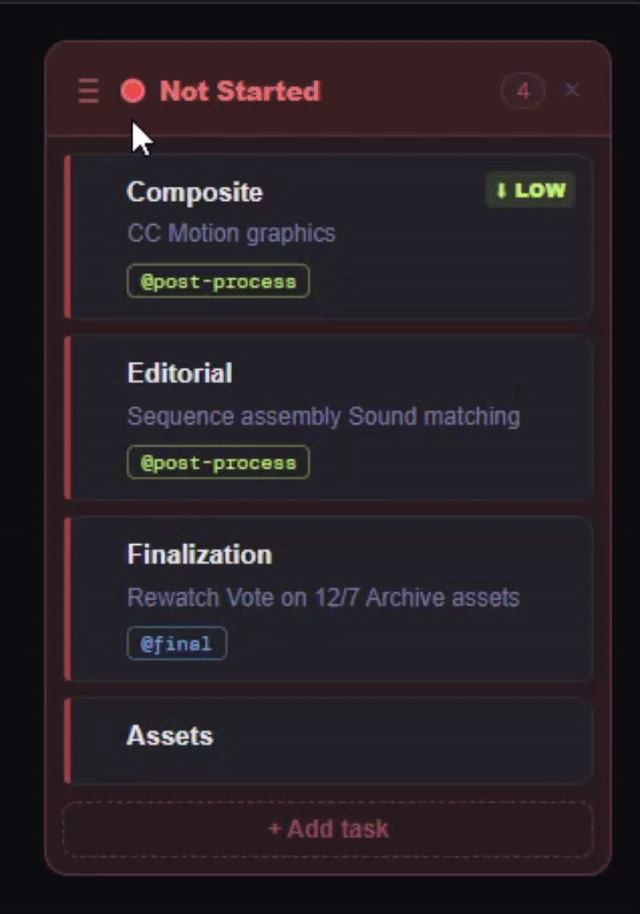
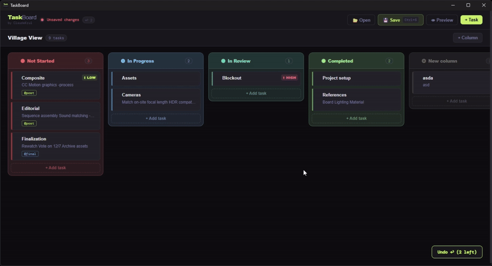

# <p align="center"></p> TaskBoard [[Download]](https://github.com/EhsanFadhli/TaskBoard/releases) or [[Build]](#build-with-electron)
Simple app that can transforms plain .txt files into structured, sortable task lists. With simple intuitive UI, it parses markdown syntax and converts them into organized tasks I can easily track and manage.

<p>
  
  
  
</p>

## Build with Electron

1. Install Electron for the project
   ```bash
    npm install electron --save-dev
    ```
2. Run the app to test the configurations
    ```bash
    npm start
    ```

3. Build the app.
   ```bash
   npm run build
   ```
The .exe will in `dist/win-unpacked/`
